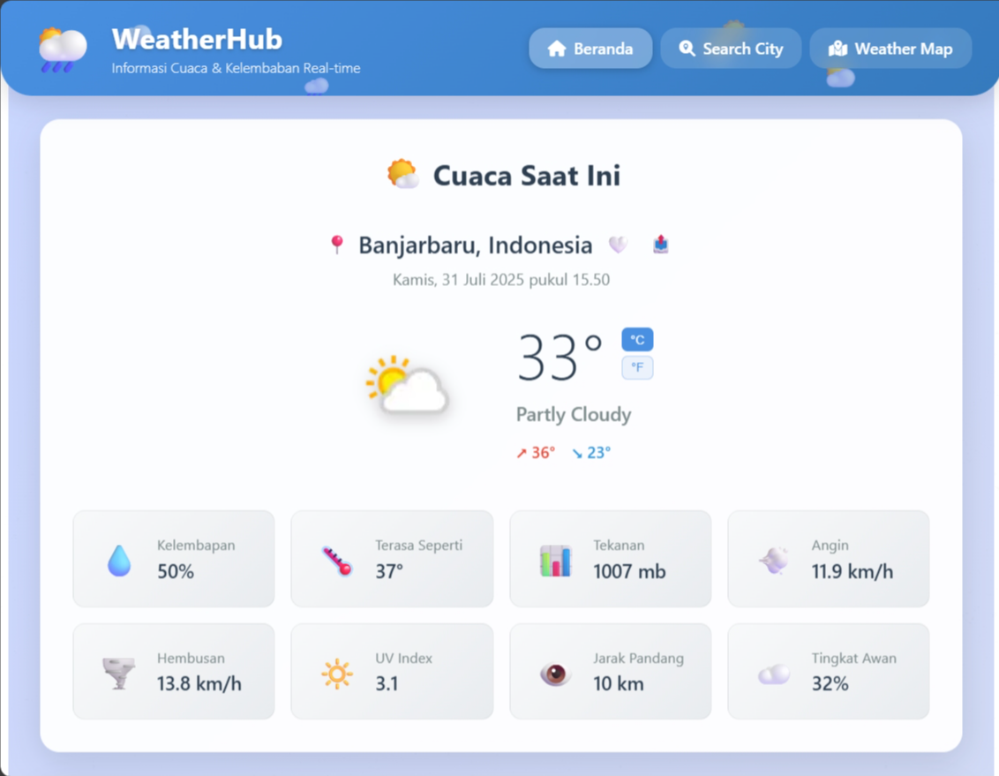
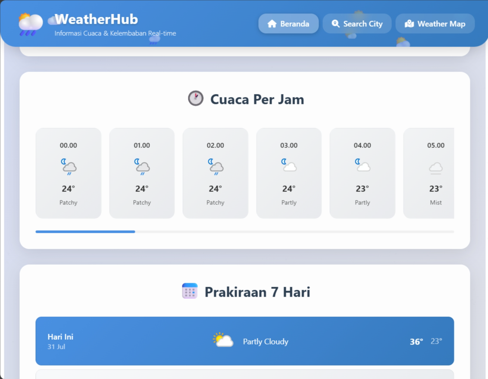
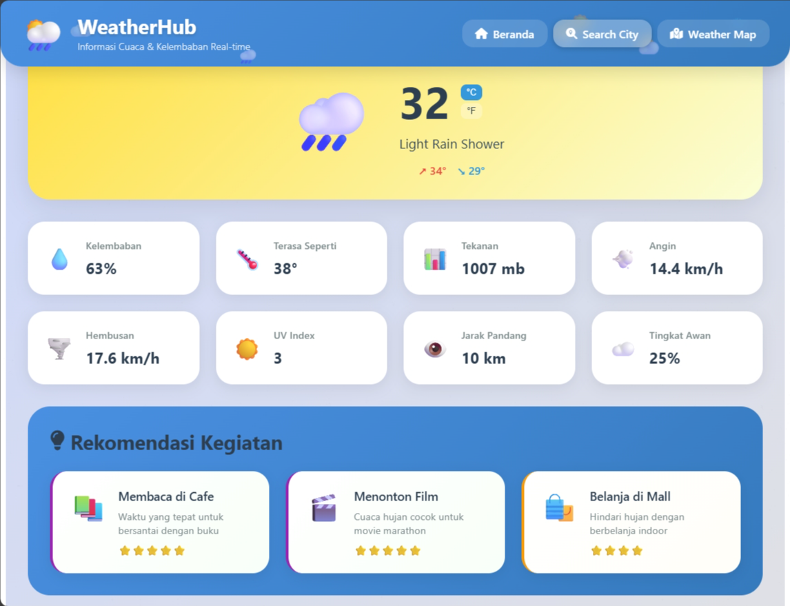
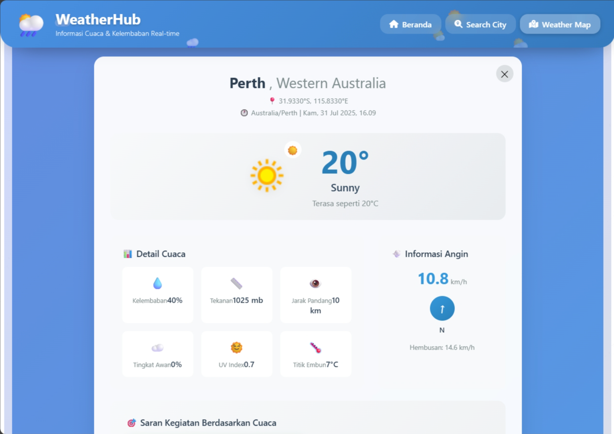

# 🌦️ WeatherHub2

**WeatherHub2** adalah aplikasi cuaca berbasis web yang menyajikan informasi cuaca terkini dan prakiraan cuaca secara real-time. Dibangun menggunakan **Vue.js** dan **JavaScript**, WeatherHub memiliki antarmuka yang responsif dan mudah digunakan untuk memantau kondisi cuaca di berbagai lokasi.

## 🔧 Teknologi yang Digunakan

- [Vue.js](https://vuejs.org/) – Framework JavaScript progresif untuk membangun antarmuka pengguna
- JavaScript – Bahasa pemrograman utama untuk logika aplikasi
- HTML & CSS – Untuk struktur dan gaya tampilan

## 📸 Cuplikan Tampilan (Screenshots)
### 🌤️ Prakiraan Cuaca Harian

  
  
  

---
### 🔍 Pencarian Cuaca

  
  

---
### 🗺️ Peta Lokasi

  
  
  

